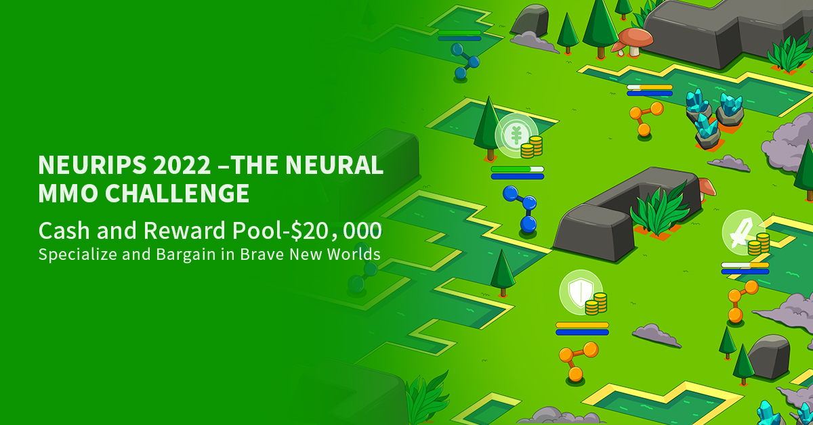

# Table of contents
- [Competition procedure](#competition-procedure)
- [Quick start](#quick-start)
    * [Install](#install)
    * [Make your first submission](#make-your-first-submission)
- [Submit your own agents](#submit-your-own-agents)
    * [Repository structure](#1-repository-structure)
    * [Custom runtime configuration](#2-custom-runtime-configuration)
    * [Implement `submission.py`](#3-implement-submissionpy)
    * [Submit](#4-submit)
- [Baseline](#baselines)
- [Local Evaluation](#local-evaluation)
- [FAQ](#faq)
- [Important links](#important-links)
- [Contributors](#contributors)


# Competition procedure

The Neural MMO Challenge is an opportunity for researchers and machine learning enthusiasts to test their skills by designing and building agents that can survive and thrive together in a massively multi-agent environment full of potential adversaries.

In this challenge, you will train your models locally and then upload them to AIcrowd (via git) to be evaluated.

**The following is a high level description of how this process works.**


1. **Sign up** to join the competition [on the AIcrowd website](https://www.aicrowd.com/challenges/neurips-2022-the-neural-mmo-challenge) and click [**Participate**](https://www.aicrowd.com/challenges/neurips-2022-the-neural-mmo-challenge) on the homepage.
2. **Clone** this repo and start developing your solution.
3. **Design and build** your agents that can compete in Neural MMO environment and create your submission as described in [Make your own submission](#make-your-own-submission) section.
4. [**Submit**](#-submission) your agents to [AIcrowd Gitlab](https://gitlab.aicrowd.com) for evaluation.


# Quick Start

## Install

Clone this starter kit repository.

```bash
git clone http://gitlab.aicrowd.com/neural-mmo/neurips2022-nmmo-starter-kit.git
conda create -n neurips2022-nmmo python==3.9
conda activate neurips2022-nmmo
cd ./neurips2022-nmmo-starter-kit
```

Install necessary dependencies, `git-lfs` is for submitting large files by git (use `brew` for mac users) and `neurips2022nmmo` is a Neural MMO environment wrapper prepared for NeurIPS 2022 Competition.

```
apt install git-lfs
pip install git+http://gitlab.aicrowd.com/neural-mmo/neurips2022-nmmo.git
pip install -r requirements_tool.txt
```

> This competition is based on NeuralMMO v1.6 version. 
> 
> For more information about NeuralMMO v1.6, please refer to https://github.com/NeuralMMO/environment/tree/v1.6.

### Make your first submission

```bash
python tool.py submit "my-first-submission"
```
See your submission on [Submissions](https://www.aicrowd.com/challenges/neurips-2022-the-neural-mmo-challenge/submissions) and 
check your rank on [Leaderboard](https://www.aicrowd.com/challenges/neurips-2022-the-neural-mmo-challenge/leaderboards) in a few minutes.

# Submit your own agents

### 1. Repository structure

**Must put all the files and models under the `my-submission/` directory. Otherwise the evaluation will fail.**

```
- my-submission/            # Directory containing your submission.
    | - other_files         # All others files needed by your submission.
    | - submission.py       # Entrypoint of your submission.
- submission-runtime        # Directory containing default Dockerfile and requirements.txt. 
- Dockerfile                # Dockerfile for your submission. 
- requirements.txt          # Python requirements for your submission.
- .submit.sh                # Helper script for submit.
- tool.py                   # Helper script for validate locally and submit.
- aicrowd.json              # Json for submit.
```

### 2. Custom runtime configuration
The default runtime is provided in `submission-runtime/`. We also accept submissions with custom runtime. The configuration files include `requirements.txt` and `Dockerfile`.

### 3. Implement `submission.py`

Here is an example of submission:
```python
from nmmo.io import action
from neurips2022nmmo import Team

class YourTeam(Team):
    def __init__(self, team_id: str, config=None, **kwargs):
        super().__init__(team_id, config)

    def act(self, observations):
        actions = {}
        if "stat" in observations:
            observations.pop("stat")
        for player_idx, obs in observations.items():
            actions[player_idx] = {}
        return actions

class Submission:
    team_klass = YourTeam
    init_params = {}
```

Note that [`YourTeam`]() class which must inherit [`Team`]() class and [`act`]() method should be implemented and we will call the function `act` for evaluation. An example with random agents is provided in `my-submission/submission.py` for your reference.

### 4. Validate locally and Submit to AICrowd

We provide `tool.py` to validate and submit your submission.

1. To locally validate your repo before submission.
```bash
python tool.py test
```

2. To submit your submission to AIcrowd gitlab.

```bash
python tool.py submit <unique-submission-name>
```

If you can see the following output, congratulations! Now you can check your submission.

``` bash
          #///(            )///#
         ////      ///      ////
        /////   //////////   ////
        /////////////////////////
     /// /////////////////////// ///
   ///////////////////////////////////
  /////////////////////////////////////
    )////////////////////////////////(
     /////                      /////
   (///////   ///       ///    //////)
  ///////////    ///////     //////////
(///////////////////////////////////////)
          /////           /////
            /////////////////
               ///////////
```
<!-- The `startby` parameter determines how to validate your submission locally
-  `--startby=process`: check your submission in *process* mode.
-  `--startby=docker`: check your submission in *docker* mode. -->

However even after seeing the above output, one can still get "failed" status on online submission webpage. It is most likely that **your local running environment is different from that of our competition server**. 
To test your repo in the exact server environment, add `--startby=docker` option when testing.

```bash
python tool.py test --startby=docker
python tool.py submit <unique-submission-name> --startby=docker
```

# Baselines

We provide a variety of baseline agents, please refer to [neurips2022-nmmo-baselines](https://gitlab.aicrowd.com/neural-mmo/neurips2022-nmmo-baseline) repository.


# Local evaluation
To do local evaluation, we provide `Rollout` for easier debug, here is an example. The environment is same with the online evaluation environment in PvE Stage 1.

```python
from neurips2022nmmo import CompetitionConfig, scripted, submission, RollOut

config = CompetitionConfig()

my_team = submission.get_team_from_submission(
    submission_path="my-submission/",
    team_id="MyTeam",
    env_config=config,
)
# Or initialize the team directly
# my_team = MyTeam("Myteam", config, ...)

teams = [scripted.CombatTeam(f"Combat-{i}", config) for i in range(5)]
teams.extend([scripted.MixtureTeam(f"Mixture-{i}", config) for i in range(10)])
teams.append(my_team)

ro = RollOut(config, teams, parallel=True, show_progress=True)
ro.run(n_episode=1)
```

# FAQ

#### 1. Are there any hardware or time constraints?

During evaluation, your submission will be allocated with **1 CPU core and 1G memory**. Each step, your Agent Team must give decision within **600ms**.

#### 2. Are there any file size limit for submission?

Your submission should not be larger than 500MB.

#### 3. How can I speed up docker image pull?

For participants in China, you can pull image from tencentcloud
```bash
python tool.py submit <unique-submission-name> --startby=docker --registry=tencentcloud
```

#### 4. How do windows users participate the competition?

For participants using windows, we strongly recommend you to install `wsl`.

#### 5. How can I render/save replay locally?

Please refer to [Unity viewer tutorial](https://www.aicrowd.com/showcase/how-to-render-replay-with-unity-client) for an instruction about how to render locally.

#### 6. `Error: Pack Exceeds Maximum Allowed Size`?

Try dividing your whole commit into multiple smaller commits.


# Important links

- Challenge information
   * [Challenge page](https://www.aicrowd.com/challenges/neurips-2022-the-neural-mmo-challenge)
   * [Leaderboard](https://www.aicrowd.com/challenges/neurips-2022-the-neural-mmo-challenge/leaderboards)
 - Community
    * [Neural MMO discord server](https://discord.gg/tYCYZf7bkn)
    * [Challenge discussion forum](https://www.aicrowd.com/challenges/neurips-2022-the-neural-mmo-challenge/discussion)
    * 微信群: chaocanshustuff 
    * 
    <!--  -->
- Neural MMO resources
    * [Neural MMO documentation](https://neuralmmo.github.io/beta/build/html/rst/game_wiki.html)
    * [Neural MMO GitHub repository](https://github.com/NeuralMMO/environment/tree/v1.6)
    * [Neural MMO Environment Tutorial](https://www.aicrowd.com/showcase/neurips-2022-neural-mmo-challenge-tutorial)
    

# Contributors
- Parametrix.ai
- Joseph Suarez
- AIcrowd


